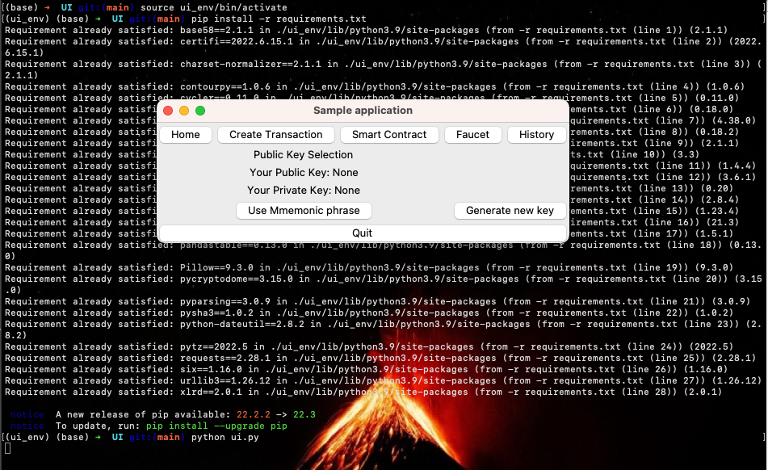
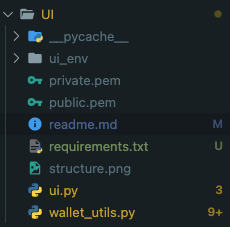

# Annall UI

## Description

Annall User Interface to interact with the block chain. The UI sends requests to the skyllian (layer 2) which propagates to Annall (blockchain). For the UI to work both skyllian and Annall need to be up and running for the UI to work and make sense.

The UI is written with tkinter a python library used to create user interfaces.

### Dependencies

- Skyllian (layer 2)
- Annall (blockchain)

## How to run

### Activate/Create virtualenv

- Mac
  - pip install virtualenv
  - virtualenv ui_env
  - source ui_env/bin/activate

### Run the application

- pip -r install requirements.txt
- python ui.py

##### Example

## Utilities

- wallet_utils.py file contains code extracted from ./src/annallclient/utils_skyllian.py

## File structure

